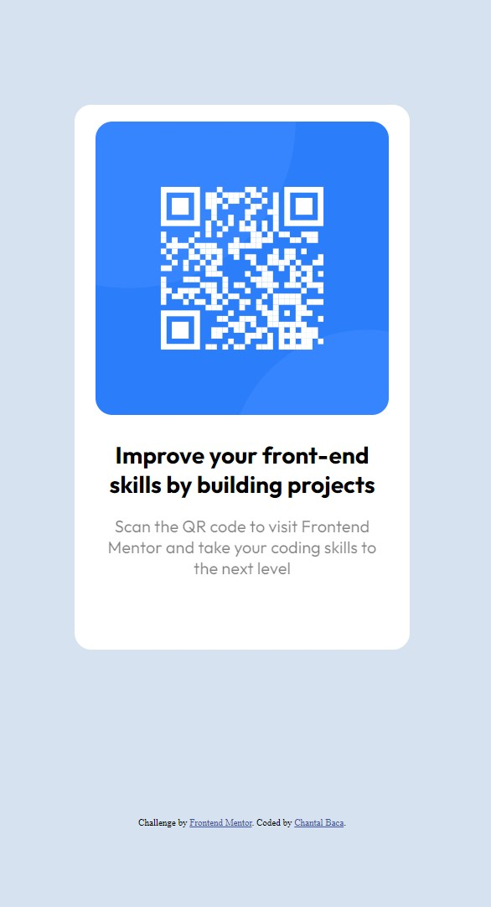

# Frontend Mentor - QR code component solution

This is a solution to the [QR code component challenge on Frontend Mentor](https://www.frontendmentor.io/challenges/qr-code-component-iux_sIO_H). Frontend Mentor challenges help you improve your coding skills by building realistic projects. 

## Table of contents

- [Overview](#overview)
  - [Screenshot](#screenshot)
  - [Links](#links)
- [My process](#my-process)
  - [Built with](#built-with)
  - [What I learned](#what-i-learned)
  - [Continued development](#continued-development)
- [Author](#author)

## Overview
  This is a simple mock-up of a QR-Code-Component that shows Responsive Web Design through HTML and CSS.
### Screenshot

<a href="https://www.figma.com/file/i6xEtHNCq9Zv5lFKJUQOCW/QR-code-component-mock?node-id=0%3A1">Figma Mockup</a>

### Links

- Solution URL: [Solution URL](https://www.frontendmentor.io/solutions/html-and-css-qr-code-component-fOktCMsXoE)
- Live Site URL: [Live Site](https://qrcodecomponentmock.netlify.app/)

## My process
  I began by setting up visual mock up site with Figma. Once all of the design was duplicated from design preview, I began making Elements that I found fitting for my HTML. After getting my HTML elements in order, I began my CSS with styles that were suggested in the Style-guide. I was able to make this web page responsive with just CSS and HTML elements.

### Built with

- Semantic HTML5 markup
- CSS custom properties

### What I learned

This project was just to solidify my knowledge. To be able to reproduce this project with custom properties was satisfying to be able to take something learned and put it into practice.

### Continued development

I want to continue to develop my CSS skills to be able to find a process that works more smoothly for myself. I want to be able to incorporate new CSS Elements to my projects that will help broden my knowledge.

## Author

- Website - [Chantal Baca](https://cbaca.dev/)
- Frontend Mentor - [@cbacaSE](https://www.frontendmentor.io/profile/CbacaSE)
- Twitter - [@cbacaSE](https://twitter.com/cbacaSE)
